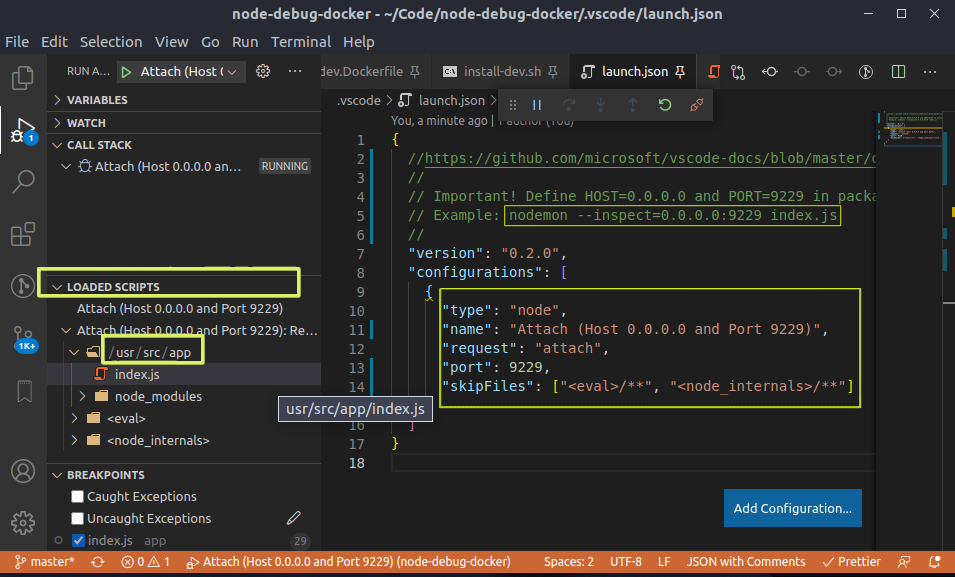

# Node, Docker and VsCode debugger inspector

# Run

```bash
# Run with nodemon support
$ ./install-dev.sh

# Run in production mode
$ ./install.sh
```

### Vscode for remote docker images

Debug vscode via loaded scripts in vscode.


